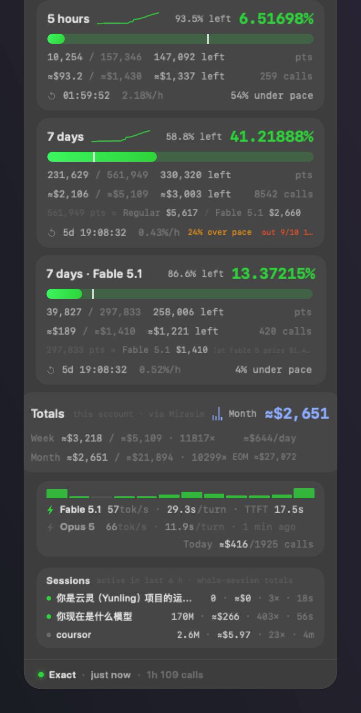
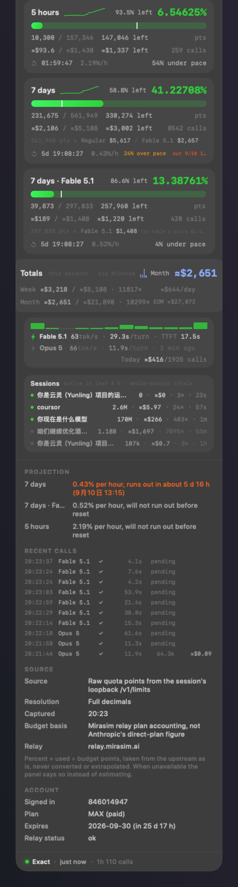
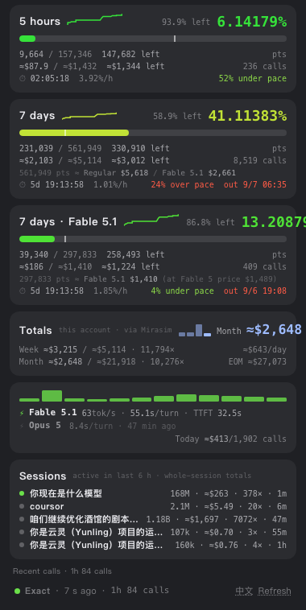
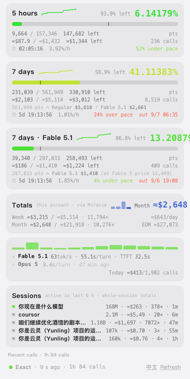

# Mirasim Telemetry

[中文](README.md) · English

A quota gauge for the Mirasim desktop client on macOS: a floating panel that can dock to a corner of the
Mirasim window, plus a menu bar icon that changes color with the remaining quota. The program reads only
local loopback endpoints and local log files. It injects nothing into Mirasim, needs no debug port and
modifies none of Mirasim's files. A Node edition for Windows and Linux lives in [`node/`](node/).

<p align="center">

&nbsp;&nbsp;

</p>

The interface is in Chinese or English: Settings › Language (follows the system by default).
Not affiliated with Mirasim or Anthropic.

## Quick start

**macOS** (macOS 14 or later; install the Command Line Tools first with `xcode-select --install`; keep Mirasim running):

```bash
git clone https://github.com/tangculiyu-wq/mirasim-telemetry.git
cd mirasim-telemetry
./install.sh
```

The script builds the app, installs "Mirasim 遥测.app" into `~/Applications` and launches it. There is no Dock
icon; the panel appears at the top right of the screen and a ring icon appears in the menu bar. To open it
later, double-click it in `~/Applications` or search "Mirasim" in Spotlight. Left-click the menu bar icon to show
or hide the panel, right-click for the menu. Tick "Launch at login" in the menu to start it automatically.

**Windows** (install [Node.js](https://nodejs.org) 22 or later first; keep Mirasim running):

```powershell
git clone https://github.com/tangculiyu-wq/mirasim-telemetry.git
cd mirasim-telemetry
node node\mirasim-telemetry.mjs --doctor     # self-check, reports each step
node node\mirasim-telemetry.mjs --app        # start, open the panel in a browser app window
```

The panel is served at `http://127.0.0.1:5990/`. Closing the window leaves the script running; open the address
again. After the script exits, run the command again. For launch at login run `node\install-windows.ps1` (see below).
Without git, use "Code → Download ZIP" on the GitHub page and run the same commands in the unpacked folder.

## What the panel shows

One card per quota window (5 hours / 7 days / 7 days · Fable 5.1). Each card has:

- **Percent**: the upstream raw points, `used ÷ budget`, with five decimals. The remaining percent is shown to the left.
- **Trend line**: usage over the last 1 / 2 / 6 hours; the span is a setting.
- **Progress bar** with an even-pace marker. Usage past the marker means you are consuming faster than even pace.
- **Points row**: `used / budget  remaining  pts`.
- **USD row**: `≈spent / ≈whole window  ≈remaining · calls in this window`.
- **Equivalents row** (both 7-day cards): `560,000 pts ≈ Regular $5,589 / Fable 5.1 $1,922`. See "How points are deducted".
- **Time row**: reset countdown (updates every second), percent per hour, distance from even pace, projected exhaustion at the current rate.

Below the cards is the **Totals** card: this week (from Monday) and this month (from the 1st) on this machine, a bar
chart of the last 14 days (hover a bar for that day), the daily average and the month-end projection.

Then the **speed bar**: one row per recently used model with tok/s, median seconds per turn and time to first token
(TTFT). Subagent calls are included. Today's spend and call count sit at the bottom right. Across the top of the bar
runs the **activity strip**: requests in the last hour, one cell per 5 minutes, green for success and red for failure
(429, 5xx, timeouts); hover for counts and the error-code breakdown. A model that hit 429 in the last 10 minutes gets a
"429" tag on its row.

Below that is the **Sessions** card: one row per Claude Code session active in the last 6 hours. The name is the
session's first message (falling back to the repository name or session id), followed by the whole-session totals:
tokens, USD, calls and time since the last call. A lit dot means a call within the last 2 minutes. Hover for
input / output / cache-read / cache-write tokens, the model mix, and calls still waiting for usage backfill. The card
can be turned off in Settings.

The **notices** block appears only when something needs attention: a window past the alert threshold (red when
exhausted), two or more failures in the last 30 minutes, rate limiting, disagreement between the two quota sources,
or usage not yet backfilled in the last 24 hours. The footer shows the data source level, data age and the number of
requests in the last hour, with failures in red.

The "L" panel size also shows the details: projected exhaustion per window, the last 10 calls (time, model, status,
duration, tokens, USD), data source, resolution, capture time, budget basis, account and plan. Collapsed to a capsule,
the panel shows only an icon and the primary window's percent; it can rest at the top edge of the screen and expands on click.

## Three rules on accuracy

**1. Percent is the upstream value; USD is an estimate; the two are labeled apart.**
Percent comes from the raw points in `/v1/limits`. Every USD figure carries `≈` and is computed from Mirasim's own
per-call metering (`~/.mirasim/insights/usage-*.ndjson`, including tokens backfilled by the relay) multiplied by the
local price list, the same basis as Mirasim's traffic page. Calls absent from the Claude Code transcript (retries after
a dropped stream, for example) are included. Whole-window USD = spent in this window ÷ used percent, so spent, whole
window, remaining and percent always agree.

**2. When data cannot be read, the panel shows an empty state instead of estimating.**
If Mirasim is not running or the token cannot be found, the panel says so. It never extrapolates a current value from old data.

**3. Every figure carries its capture time.**
The footer shows the source level and age, for example "Exact · just now", and changes color after 90 seconds.
A speed row with no new request for 90 seconds dims and shows "N min ago". The menu bar icon turns grey when data is stale.

All money and statistics count only the signed-in account. Switching accounts switches the panel; other accounts' records are excluded.

## How points are deducted (measured)

Quota is counted in points, not dollars. Comparing hourly point increments with the USD computed at list price for
the same hour, using only hours in which a single model ran, gives:

| Model | Points per $1 of list price | Per point | Note |
|---|---|---|---|
| Opus / Sonnet and other regular models | 100 | $0.0100 | Opus-only hours measured 96–101 |
| Fable 5 | 200 (at Fable 5 list price) | $0.0050 | Fable-5-only hours measured 197–201 |
| Fable 5.1 | 200 (still at Fable 5 list price) | ≈$0.0034 | Predicting the whole Fable window with Fable 5 weights is off by −0.2% |

Consequences:

- A Fable call is counted in both the 7-day window and the Fable window, with the same increment. Regular models count
  only toward the 7-day window; the Fable window does not move.
- Fable 5.1 has a lower list price than Fable 5 (cache read $1 → $0.25) but is still charged at Fable 5 weights.
  The same points buy the same tokens on 5.1 as on 5. The smaller USD figure for 5.1 on the panel means the same usage
  costs less at 5.1 list prices; the quota itself is not smaller.
- One point is about one cent of regular-model list price, or about half a cent of Fable list price. Per token, Fable costs about 4× the points of Opus.

The equivalents row: regular USD per point = actual spend on non-Fable models in this window ÷ points used by non-Fable
models; Fable 5.1 USD per point = all Fable calls in the window repriced at 5.1 ÷ points used in the Fable window.
With too few samples the formula from the table is used. The audit scripts are in [`scripts/points-audit/`](scripts/points-audit/):

```bash
perl scripts/points-audit/ptsfit.pl  usr_xxx   # hourly: point increments vs. USD per model
perl scripts/points-audit/ptsfit2.pl usr_xxx   # points per model class ÷ USD at each price list
perl scripts/points-audit/ptsfit3.pl usr_xxx   # which weights Fable 5.1 is charged at (three hypotheses)
```

`usr_xxx` is the `userId` in Mirasim's logs; `--diag` prints it. The scripts read this program's percent samples in
`~/Library/Application Support/EduHuan/samples.json` and Mirasim's logs.

## Data sources

| Data | Source | Notes |
|---|---|---|
| Used points, budget points, reset time | `http://127.0.0.1:<session port>/v1/limits` | Full decimals. The token exists only in the session process's environment; it is paired per process with `ps eww`. If the account does not match the frame, the whole reading is discarded |
| Percent, reset time (fallback) | relay frame on `ws://127.0.0.1:<port>/mirachannel/ws` | Same data as the Mirasim UI, 0.1% resolution. Only needs Mirasim running |
| Spend | `~/.mirasim/insights/usage-*.ndjson` | Per-call relay metering. Tokens are backfilled in place, so files are re-parsed when size or mtime changes; no read cursor |
| Price list | `~/.mirasim/models-dev-cache.json` | Four prices kept. Missing or zero prices fall back to a built-in list |
| Speed | `durationMs` from insights and the Claude Code transcript `~/.claude/projects/**/*.jsonl` | Paired by `providerCallId == requestId`. TTFT is the time the first content block was written, an upper bound |

The two quota sources carry the same data (the frame's `usage.source` is `relay-limits`). When both are available they
are cross-checked; a difference above 0.35 points is flagged in the details. Budget points are Mirasim relay plan
figures, not Anthropic's direct-plan quota.

The program makes no outbound network requests and reads only local loopback ports and local files. It writes only its samples
(kept 24 hours), calibration file, account vault and `setting.json` backups under `~/Library/Application Support/EduHuan/`, and
its preferences in UserDefaults. The one write into Mirasim's directory is the sign-in block replacement in `~/.mirasim/setting.json`
when you click "Switch account" (see the section above), always preceded by a backup. The vault holds the encrypted sign-in blocks
Mirasim wrote; this program does not parse them. Turn off "Remember signed-in accounts" to stop recording them.

## Using the panel

- Drag empty space to move the panel. Drag an edge or corner to zoom (0.7×–1.8×); the whole content scales.
- Title bar buttons: embed in Mirasim, click-through, refresh, size (S / M / L), collapse to capsule, settings.
- **Embed in Mirasim**: the panel docks to one of the four corners of the Mirasim window and follows it. The top
  corners leave room for the toolbar; the offset is remembered after you drag. The panel hides when Mirasim is not in front.
- **Click-through**: mouse events pass through to the window behind. Hover for 1 second (or hold ⌥) to interact; move away to resume.
- **Right-click** the panel or the menu bar icon for the menu: show / capsule / click-through / only when Mirasim is in
  front / always on top / move to top right / percent in menu bar / primary window / size / zoom / opacity / launch at login / refresh / quit.
- **Settings** (gear): zoom, always on top, show only in Mirasim, embed corner, click-through, appearance (system / dark / light),
  language (system / 中文 / English), sessions card, menu bar percent and window, quota alert and threshold (50%–99%),
  trend span, launch at login, reset position, rescan ledger.
- The menu bar icon follows the window with the least left (configurable). Left-click shows or hides the panel.
- **One-click account switching**: click the account name at the top of the panel to list the Mirasim cloud accounts you have
  signed in to, and pick one. The right-click menu has the same "Switch account" list. Each entry shows the 7-day quota left
  when it was last seen and how long ago. Details in the next section.

## One-click account switching

Mirasim's cloud account (the name at the top of the panel; the quota windows belong to it) can only be signed out and signed in
again with a verification code; there is no account pool. This program adds one:

1. Every account you sign in to in Mirasim has its sign-in block (`auth` in `~/.mirasim/setting.json`) recorded in a local vault,
   `~/Library/Application Support/EduHuan/accounts.json` (mode 0600, readable only by you). The block is ciphertext that Mirasim
   wrote with a machine-bound key; this program does not parse, decrypt or send it. It is stored as is.
2. Switching backs up the whole `setting.json` to `EduHuan/setting-backups/` (12 kept), then atomically replaces the sign-in block
   with the chosen account's. Mirasim re-reads this file every time it uses the token, so no restart is needed, running Claude Code
   sessions are untouched, and subsequent calls are billed to the new account.
3. Verification: the session loopback `/v1/limits` answers for the new account, or the relay frame's account becomes the target.
   If a session is running but `/v1/limits` still reports the old account, the switch did not take and the backup is restored
   automatically. With no active session `/v1/limits` is unavailable and the frame (a long-lived connection) may lag; the panel
   then says "Mirasim has not confirmed yet" and offers an Undo button.

Limits and caveats:

- The sign-in block is bound to this machine (AES-GCM, key in the system keychain). The vault cannot be copied to another computer.
- After switching, Mirasim's mirachannel connection and device registration stay with the old account until it reconnects on its
  own; meanwhile Mirasim's own UI may still show the old account name and the paired-device list may sit under the wrong account.
  This panel follows the `/v1/limits` account and is unaffected.
- An account unused for a long time may have an expired refresh token. Mirasim will then ask you to sign in again; click Undo to
  return to the previous account.
- Do not restart Mirasim's host as part of this: `restartHost` kills every Claude Code session process it spawned, and their
  loopback routes die with them.
- Settings let you turn off "Remember signed-in accounts" or clear the vault.

When Mirasim's log changes, speed, spend and points refresh within 1.2–5 seconds. Points are read every 20 seconds; frames update immediately.

## Windows / Linux: the Node edition

[`node/`](node/) holds a Node 22+ script with the same methodology and no dependencies. The script computes in the
background; the panel is a local web page (`http://127.0.0.1:5990/`, openable as an Edge or Chrome app window) updated
over SSE. It has the same sections as the macOS panel, including the activity strip, sessions card, notices and the
expandable recent-calls list. The footer toggles between English and Chinese; `--lang en` sets the default and
`--alert 80` changes the threshold for notices. The three Windows-specific parts (finding the Mirasim process, reading
the session token, launch at login) are written against Windows APIs but have not been tested on Windows. Run
`--doctor` first; it reports which step fails. See [node/README.md](node/README.md) (Chinese) for what to change.

<p align="center">

&nbsp;&nbsp;

</p>

```powershell
node node\mirasim-telemetry.mjs --doctor                          # self-check first
node node\mirasim-telemetry.mjs --app --lang en                   # start, open the panel in an app window
powershell -ExecutionPolicy Bypass -File node\install-windows.ps1  # launch at login
```

## Install (macOS native)

Only the Command Line Tools are needed, not the full Xcode. The source avoids macros such as `@State`; local state
uses `ObservableObject`. Requires macOS 14 or later.

```bash
./install.sh                             # build, install into ~/Applications, launch
"~/Applications/Mirasim 遥测.app/Contents/MacOS/Mirasim 遥测" --login on|off|status   # launch at login
```

The bundle id is `local.eduhuan.ring`; preferences are stored under it. The app is ad-hoc signed and no prebuilt
package is offered: an unsigned download would be quarantined by Gatekeeper, a local build is not.

## Troubleshooting

```bash
"~/Applications/Mirasim 遥测.app/Contents/MacOS/Mirasim 遥测" --diag
```

Checks and reports in order: process table, whether Mirasim is running, session routes and tokens, raw `/v1/limits`
values per window, the mirachannel frame, cross-check, price probe, today's ledger and backfill gap, equivalent
rates, sessions, request statistics, speed pairing rate.

The panel can be rendered off-screen to an image without screen-recording permission:

```bash
遥测 --render /tmp/p.png [--light] [--detail] [--wait seconds]
MT_LANG=en 遥测 --render /tmp/p.png          # English interface
MT_SIZE=compact 遥测 --render /tmp/p.png     # compact size (default standard; --detail = full)
遥测 --render-capsule /tmp/c.png
遥测 --render-icons /tmp/i.png [--light]
```

## Compared with similar tools

Among third-party tools, [MiraQuota](https://github.com/Heartcoolman/MiraQuota) injects its widget into Mirasim's
renderer through CDP and needs Mirasim started with `--remote-debugging-port`. This project uses a separate window that
follows the Mirasim window via CGWindowList, needs no debug port and leaves Mirasim's process isolation alone. On
methodology see "Three rules on accuracy": no full-quota regression calibration, no estimating when data is unavailable.
Both are independent third-party tools unrelated to Mirasim.

## Known limitations

- The native panel is macOS only. Windows / Linux use the Node edition in `node/`, a web panel that cannot stay on top and is untested on Windows.
- TTFT is an upper bound. There is no per-request first-token timestamp locally, only the time the first content block was written. For thinking models the first block is the whole thought.
- Only calls from this machine are counted. Spend by the same account on other computers is missing, so spent and whole-window USD run low.
- USD is an equivalent at list price, not a bill.
- `/v1/limits` is undocumented and may stop working after a Mirasim update. The panel then falls back to frame data at 0.1% resolution.

## Source layout

```
Sources/
  Model.swift           data model: windows, pace, burn rate, account
  SessionScanner.swift  pair session ports with tokens from the process table
  LimitsClient.swift    /v1/limits client with same-account check
  RelayClient.swift     mirachannel WebSocket client
  CostLedger.swift      spend ledger (per-call insights × price list), repricing, sessions, request stats
  Calibrator.swift      fallback per-point calibration (windows older than local metering)
  AccountVault.swift    account vault: remembers signed-in accounts; backs up and replaces the sign-in block in setting.json
  SpeedStats.swift      speed: durations paired with tokens by request id, subagent logs, session titles
  Store.swift           merge sources, samples, spend, equivalents, alerts, notices
  Theme.swift           colors, fonts, formatting, language switch
  EnglishStrings.swift  English UI strings keyed by the Chinese source text
  StatusIcon.swift      menu bar icon
  PanelView.swift       floating panel, speed bar, sessions card, notices
  WindowCard.swift      window cards, totals card
  CapsuleView.swift     capsule form
  SettingsView.swift    settings
  DetailSection.swift   details, recent calls
  AppDelegate.swift     windows, embed tracking, click-through, tooltips, menu
  Preview.swift         off-screen rendering
  Diagnose.swift        --diag
  main.swift            entry, command line, single instance
```

## Buy the author a bubble tea

If this project is useful to you, a bubble tea is appreciated. Any amount; the software works the same either way.

<p align="center">

&nbsp;&nbsp;&nbsp;&nbsp;

</p>

MIT License. Unofficial project, not affiliated with Mirasim or Anthropic.
