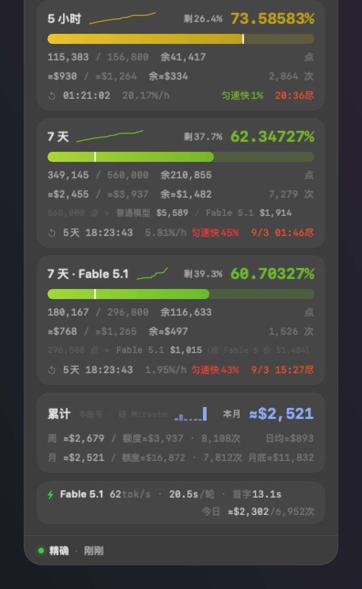
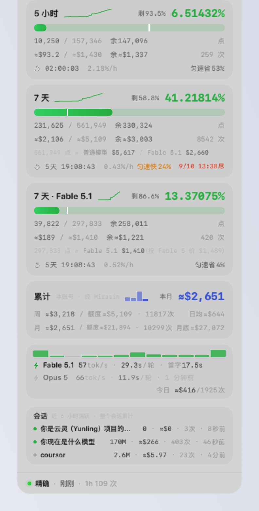
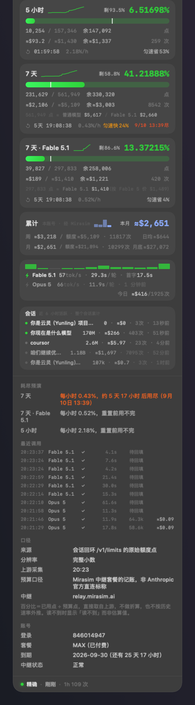
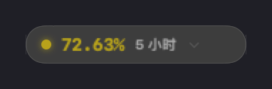
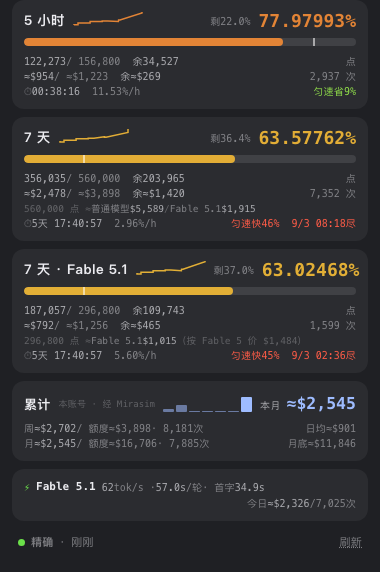
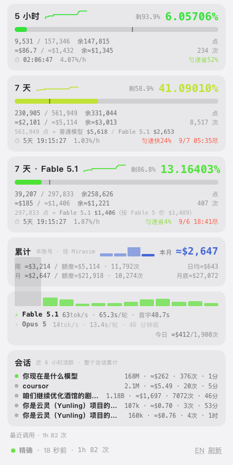

# Mirasim 遥测

中文 · [English](README.en.md)

macOS 上的 Mirasim 额度仪表。它由一个悬浮面板和一个菜单栏图标组成：面板常驻桌面，可以贴在 Mirasim 窗口的角上；
菜单栏图标按剩余额度变色。程序只读取本机回环接口和本机日志文件，不向 Mirasim 注入代码，不需要调试端口，
不修改 Mirasim 的任何文件。

<p align="center">

&nbsp;&nbsp;

</p>

> An unofficial quota dashboard for the Mirasim desktop client. The interface is available in
> English (Settings › Language); the English documentation is in [README.en.md](README.en.md).
> Not affiliated with Mirasim or Anthropic.

## 快速开始

**macOS**（macOS 14 或更新，先装 Command Line Tools：终端运行 `xcode-select --install`；Mirasim 保持运行）：

```bash
git clone https://github.com/tangculiyu-wq/mirasim-telemetry.git
cd mirasim-telemetry
./install.sh
```

脚本会编译、把「Mirasim 遥测.app」装进 `~/Applications` 并启动。启动后没有 Dock 图标，
屏幕右上角出现悬浮面板，菜单栏出现一个圆环图标。以后要打开它，在 Finder 的 `~/Applications`
里双击，或用 Spotlight 搜「Mirasim 遥测」。左键点菜单栏图标可以显示或隐藏面板，右键打开菜单。
要开机自启，在菜单里勾「开机自动启动」。

**Windows**（先装 [Node.js](https://nodejs.org) 22 或更新；Mirasim 保持运行）：

```powershell
git clone https://github.com/tangculiyu-wq/mirasim-telemetry.git
cd mirasim-telemetry
node node\mirasim-telemetry.mjs --doctor     # 自检，看每一步是否通过
node node\mirasim-telemetry.mjs --app        # 启动，并在浏览器应用窗口里打开面板
```

面板地址是 `http://127.0.0.1:5990/`。关掉窗口后台脚本仍在运行，重新打开这个地址即可；
脚本退出后重新运行上面的命令。要开机自启，运行 `node\install-windows.ps1`（见下文）。
没有 git 的话，在 GitHub 页面点「Code → Download ZIP」解压后同样运行。

## 面板内容

每个额度窗口一张卡（5 小时 / 7 天 / 7 天 · Fable 5.1）。每张卡包含：

- **百分比**：上游原始额度点 `used ÷ budget`，保留五位小数。右侧显示剩余百分比。
- **走势线**：近 1 / 2 / 6 小时的用量曲线，跨度在设置里选择。
- **进度条**：带匀速线。用量超过匀速线，表示消耗快于匀速。
- **点数行**：`已用 / 预算 余多少 点`。
- **金额行**：`≈已花 / ≈整窗 余≈多少 · 窗口内调用次数`。
- **等价行**（两张 7 天卡）：`560,000 点 ≈ 普通模型 $5,589 / Fable 5.1 $1,922`。计算方法见「额度点的扣法」。
- **时间行**：重置倒计时（每秒更新）、每小时消耗的百分点、与匀速线的差距、按当前速率的用尽时刻。

下面是累计卡：本周（周一起）和本月（1 号起）的本机花费、近 14 天每日花费的柱状图（指向柱子显示当天明细）、
日均花费、月底预估。最后是速度栏：近期使用的每个模型各一行，显示 tok/s、每轮耗时中位数、首字时间，
子代理的调用也计入。今日花费与调用次数显示在右下角。

速度栏顶部是**活动条**：近 1 小时的请求，每格 5 分钟，绿色是成功，红色是失败（429、5xx、超时），
悬停显示次数与错误码分布。某个模型近 10 分钟撞过 429 时，它那一行的模型名后面标「限流」。

速度栏下面是**会话卡**：近 6 小时有调用的每个 Claude Code 会话各一行。名字取该会话的第一句话，
没有账本时用仓库名或会话号；后面是整个会话累计的 token、美元、调用次数和最近一次调用距今的时间，
点亮的圆点表示 2 分钟内有调用。悬停显示输入 / 输出 / 缓存读 / 缓存写的 token、模型分布，以及还没回填用量的调用次数。
会话卡可以在设置里关掉。

会话卡下面是**提示区块**，只在有事时出现：某个窗口越过警戒线（已用满为红色）、近 30 分钟失败 2 次以上、限流、
两路口径读数不一致、近 24 小时有用量没回填。页脚显示口径、数据时间和近 1 小时的请求数，有失败时用红色标出失败次数。

<p align="center">

&nbsp;&nbsp;

</p>

「大」尺寸下还显示明细：各窗口的用尽时刻、最近 10 次调用（时刻、模型、状态、耗时、token、金额）、
数据来源、分辨率、上游采集时刻、预算口径、账号与套餐。
收成胶囊后只显示一个小图标和主窗口的百分比，可以停在屏幕顶边，点一下展开。

## 准确性上的三条原则

**1. 百分比是上游原始值，美元是估算，两者分开标注。**
百分比来自 `/v1/limits` 的原始额度点。美元一律带 `≈`，按 Mirasim 自己的逐调用计量
（`~/.mirasim/insights/usage-*.ndjson`，包含 relay 回填的 token）乘以本地价目表得出，
与 Mirasim 流量监控页的口径相同。断流重试等 Claude Code 日志中没有的调用也计入。
整窗金额 = 本窗口已花金额 ÷ 已用百分比。这样已花、整窗、余量与百分比之间始终一致。

**2. 读不到数据时显示空态，不推算。**
Mirasim 没有运行、或拿不到令牌时，面板显示空态，不用旧数据推算一个当前值。

**3. 每个数据都标注采集时间。**
面板底部显示数据来源级别和距今时间，例如「精确 · 刚刚」，超过 90 秒变色。
速度行超过 90 秒没有新请求时变暗，并标注「N 分钟前」。菜单栏图标在数据过期时变为灰色。

所有金额与统计只计入当前登录的账号。切换账号后面板自动切换，不计入其他账号的记录。

## 额度点的扣法（实测）

额度的单位是点，不是美元。按小时统计点数增量，与同一小时内按官方价目计算的美元对照，
只取只有一种模型在运行的小时，得到：

| 模型 | 每 $1 官方标价扣多少点 | 每点折合 | 备注 |
|---|---|---|---|
| Opus / Sonnet 等普通模型 | 100 点 | $0.0100 | 只运行 Opus 的小时实测 96–101 |
| Fable 5 | 200 点（按 Fable 5 标价） | $0.0050 | 只运行 Fable 5 的小时实测 197–201 |
| Fable 5.1 | 200 点（仍按 Fable 5 标价） | ≈$0.0034 | 用 Fable 5 的权重预测整个 Fable 窗口的点数，偏差 −0.2% |

由此得到：

- Fable 调用同时计入 7 天窗口与 Fable 窗口，两个窗口的增量相同。普通模型只计入 7 天窗口，Fable 窗口的点数不变。
- Fable 5.1 的官方标价比 Fable 5 低（缓存读从 $1 降到 $0.25），但扣点仍按 Fable 5 的价目。
  同样的点在 5.1 上能处理的 token 与 5 相同。面板上 5.1 的美元数比 5 小，是因为同样的用量按 5.1 标价计算金额更低，额度本身没有变少。
- 1 点约等于 1 分钱普通模型标价，约等于半分钱 Fable 标价。Fable 每个 token 扣的点约为 Opus 的 4 倍。

等价行的计算方法：普通模型的每点美元 = 本窗口内非 Fable 模型的实际花费 ÷ 非 Fable 模型占用的点数；
Fable 5.1 的每点美元 = 窗口内全部 Fable 调用按 5.1 价目重新计算的金额 ÷ Fable 窗口已用点数。
样本不足时使用上表的公式。审计脚本在 [`scripts/points-audit/`](scripts/points-audit/)：

```bash
perl scripts/points-audit/ptsfit.pl  usr_xxx   # 按小时对照：点数增量与各模型美元
perl scripts/points-audit/ptsfit2.pl usr_xxx   # 每类模型的点数 ÷ 各价目美元
perl scripts/points-audit/ptsfit3.pl usr_xxx   # 检验 Fable 5.1 按哪套权重扣点（三个假设）
```

`usr_xxx` 是 Mirasim 日志里的 `userId`，`--diag` 会打印出来。脚本读取本机
`~/Library/Application Support/EduHuan/samples.json`（本程序保存的百分比采样）与 Mirasim 日志。

## 数据来源

| 数据 | 来源 | 说明 |
|---|---|---|
| 已用点、预算点、重置时刻 | `http://127.0.0.1:<会话端口>/v1/limits` | 完整小数。令牌只存在于会话进程的环境变量里，用 `ps eww` 按进程配对。读到的账号与帧不一致时，整份数据不用 |
| 百分比、重置时刻（备用来源） | `ws://127.0.0.1:<port>/mirachannel/ws` 的 relay 帧 | 与 Mirasim 界面的数据相同，分辨率 0.1%。只要求 Mirasim 在运行 |
| 花费 | `~/.mirasim/insights/usage-*.ndjson` | relay 逐调用计量。token 由云端回填并原地改写，所以按文件的大小和修改时间判断变化后重新解析，不用读取游标 |
| 价目表 | `~/.mirasim/models-dev-cache.json` | 只保留四项价格。缺失或价格为零时使用内置官方价目 |
| 速度 | insights 的 `durationMs` 与 Claude Code 日志 `~/.claude/projects/**/*.jsonl` | 按 `providerCallId == requestId` 配对。首字时间取第一个内容块写入日志的时刻，是真实首字时间的上界 |

两个额度来源的数据相同（帧里 `usage.source` 为 `relay-limits`）。两者都可用时做交叉校验，差值超过 0.35 个百分点时在明细里提示。
预算点是 Mirasim 中继套餐的数值，不是 Anthropic 官方直连套餐的标称额度。

程序不发起对外网络请求，只读取本机回环端口与本机文件。写入的文件只有 `~/Library/Application Support/EduHuan/` 下的采样
（保留 24 小时）、标定文件、账号库与 `setting.json` 备份，以及 UserDefaults 里的偏好设置。
唯一会写到 Mirasim 目录里的动作是你主动点「切换账号」时替换 `~/.mirasim/setting.json` 的登录块（见「一键切换账号」），
替换前必备份。账号库保存的是 Mirasim 写出的加密登录块，本程序不解析它。关掉「记住登录过的账号」后不再保存。

## 使用

- 拖动面板空白处可以移动。拖动边缘或角落可以缩放（0.7×–1.8×），内容整体缩放，点击区域随之变化。
- 标题栏按钮：嵌入 Mirasim、鼠标穿透、刷新、大小（小 / 中 / 大）、收成胶囊、设置。
- **嵌入 Mirasim**：面板贴在 Mirasim 窗口的一个角（四角可选），随窗口移动和缩放。
  顶部默认留出工具栏的高度，拖动后记住偏移。Mirasim 不在前台时面板自动隐藏。
- **鼠标穿透**：鼠标事件穿过面板传给下面的窗口。鼠标在面板上停留 1 秒（或按住 ⌥）后可以操作面板，移开后恢复穿透。
- **右键**面板或菜单栏图标打开菜单：显示 / 胶囊 / 穿透 / 只在 Mirasim 前台时显示 / 钉在最前 / 移回右上角 /
  菜单栏百分比 / 主要显示哪个窗口 / 大小 / 缩放 / 透明度 / 开机自启 / 刷新 / 退出。
- **设置**（齿轮）：内容缩放、钉在最前、只在 Mirasim 里显示、嵌入位置、鼠标穿透、外观（跟随系统 / 深 / 浅）、
  语言（跟随系统 / 中文 / English）、会话卡开关、菜单栏百分比与显示哪个窗口、额度警报与警戒线（50%–99%）、
  走势线跨度、开机自启、重置窗口位置、重扫账本。
- 菜单栏图标显示剩余最少的窗口（可在设置里改）。左键点击显示或隐藏面板。
- **一键切换账号**：点面板顶上的账号名，列出在 Mirasim 里登录过的云端账号，点谁切谁；右键菜单里有同一份「切换账号」。
  每个账号旁标注上次看到的 7 天余量和多久前在线。做法见下一节。

## 一键切换账号

Mirasim 的云端账号（面板顶上那个名字，额度窗口跟它走）只能登出再重新验证码登录，没有多账号池。
本程序补上这一步：

1. 你在 Mirasim 里登录过的每个账号，登录块（`~/.mirasim/setting.json` 里的 `auth`）会自动记进本机账号库
   `~/Library/Application Support/EduHuan/accounts.json`（权限 0600，仅本人可读）。这个块是 Mirasim 用本机密钥加密后写出的密文，
   本程序不解析、不解密、不外发，只原样保存。
2. 切换时：先把整份 `setting.json` 备份到 `EduHuan/setting-backups/`（保留 12 份），再把选中账号的登录块原子替换进去。
   Mirasim 每次用 token 都重新读这个文件，所以不需要重启，正在跑的 Claude Code 会话不受影响，之后的调用直接记到新账号。
3. 然后核对：会话回环的 `/v1/limits` 按新账号返回，或 relay 帧里的账号变成目标，即为成功。有会话在、却仍读到旧账号，
   说明没切过去，自动还原备份。没有活跃会话时读不到 `/v1/limits`，帧又走长连接可能滞后，这时显示「Mirasim 还没确认」并给出「还原」按钮。

限制与注意：

- 登录块绑定本机（AES-GCM，密钥在系统钥匙串）。账号库不能拷到别的电脑用。
- 切走后 Mirasim 的 mirachannel 长连接和设备注册仍挂在旧账号，直到它自然重连；期间 Mirasim 界面里的账号名可能还是旧的，
  远程配对的设备列表也可能挂错账号。本面板以 `/v1/limits` 的账号为准，不受影响。
- 长时间没用过的账号，其刷新令牌可能已失效。切过去后 Mirasim 会要求重新登录；点「还原」回到原账号即可。
- 不要在这一步之外重启 Mirasim 服务：`restartHost` 会杀掉它拉起的全部 Claude Code 会话进程，会话的回环路由也随之失效。
- 设置里可以关掉「记住登录过的账号」，或「清空账号库」。
- 命令行也能切，走同一套流程并打印进度：`遥测 --switch-account <账号名或 userId 或其前缀>`，退出码 0 成功、1 失败并已还原、3 已写入待确认。

实测（2026-09-05，两个 MAX 账号互切）：每次 5–10 秒确认，正在跑的 Claude Code 会话不受影响，relay 帧里的账号也即时跟随，没有出现滞后。

Mirasim 日志文件有变化时，速度、花费与点数在 1.2 到 5 秒内刷新。额度点每 20 秒读取一次，帧数据到达时立即更新。

## Windows / Linux：跨平台版

[`node/`](node/) 目录下是同一套口径的 Node 22+ 脚本，没有外部依赖。脚本在后台计算数据，面板是本机网页
（`http://127.0.0.1:5990/`，可以用 Edge 或 Chrome 的应用窗口模式打开）。数据变化时通过 SSE 推送到页面。
面板内容与 macOS 版相同，包括活动条、会话卡、提示区块和可展开的最近调用；页脚可以切换中英文，
`--lang en` 设默认语言，`--alert 80` 改提示区块的警戒线。
Windows 特有的三部分（查找 Mirasim 进程、读取会话令牌、开机自启）按 Windows 的接口编写，没有在 Windows 上测试过。
安装后先运行 `--doctor`，它会报告哪一步失败。修改方法见 [node/README.md](node/README.md)。

<p align="center">

&nbsp;&nbsp;

</p>

```powershell
node node\mirasim-telemetry.mjs --doctor                          # 先自检
node node\mirasim-telemetry.mjs --app                             # 启动服务，用应用窗口打开面板
powershell -ExecutionPolicy Bypass -File node\install-windows.ps1  # 登录时自动启动
```

## 安装（macOS 原生版）

只需要 Command Line Tools，不需要完整的 Xcode。源码不使用 `@State` 等宏，本地状态全部使用 `ObservableObject`。
要求 macOS 14 或更新。

```bash
./install.sh                             # 构建，安装到 ~/Applications，启动
"~/Applications/Mirasim 遥测.app/Contents/MacOS/Mirasim 遥测" --login on|off|status   # 开机自启
```

bundle id 为 `local.eduhuan.ring`，偏好设置按它保存。修改后会丢失已保存的位置和透明度设置。
程序使用临时签名（ad-hoc），不提供预编译包：未签名的下载包会被 Gatekeeper 隔离，本地构建没有这个问题。

## 排障

```bash
"~/Applications/Mirasim 遥测.app/Contents/MacOS/Mirasim 遥测" --diag
```

依次检查并报告：进程表、Mirasim 是否运行、会话路由与令牌、`/v1/limits` 各窗口原始值、mirachannel 帧、
交叉校验、价目探针、今日账本与回填缺口、等价换算单价、速度配对率。

面板可以离屏渲染为图片，不需要屏幕录制权限：

```bash
遥测 --render /tmp/p.png [--light] [--detail] [--wait 秒]
MT_LANG=en 遥测 --render /tmp/p.png          # 英文界面
MT_SIZE=compact 遥测 --render /tmp/p.png     # 小档（默认标准档，--detail 为大档）
遥测 --render-capsule /tmp/c.png
遥测 --render-icons /tmp/i.png [--light]
```

## 与其它同类工具的区别

同类第三方工具中，[MiraQuota](https://github.com/Heartcoolman/MiraQuota) 把控件通过 CDP 注入 Mirasim 的渲染进程，
需要 Mirasim 以 `--remote-debugging-port` 启动。本项目使用独立窗口，通过 CGWindowList 跟随 Mirasim 窗口的位置，
不需要调试端口，不影响 Mirasim 的进程隔离。口径上的取舍见「准确性上的三条原则」：不做满额回归标定，读不到数据时不推算。
两者都是独立的第三方工具，与 Mirasim 官方无关。

## 已知限制

- 原生面板只支持 macOS。Windows / Linux 使用 `node/` 下的跨平台版，它是网页面板，不能置顶，没有在 Windows 上测试过。
- 首字时间是上界。本机没有逐请求的首 token 时刻，只能取第一个内容块写入日志的时刻。思考型模型的第一块是整段思考。
- 只统计本机的调用。同一账号在其他电脑上的花费不计入，已花与整窗金额偏低。
- 美元是按官方价目折算的等价金额，不是账单。
- `/v1/limits` 未公开，Mirasim 更新后可能失效。失效时改用帧数据，分辨率 0.1%。

## 源码

```
Sources/
  Model.swift           数据模型：窗口、匀速线、消耗速率、账号
  SessionScanner.swift  从进程表配对会话端口与令牌
  LimitsClient.swift    /v1/limits 客户端，含同账号校验
  RelayClient.swift     mirachannel WebSocket 客户端
  CostLedger.swift      花费账本（insights 逐调用 × 价目表），支持按指定模型重算
  Calibrator.swift      每点单价的备用标定（窗口早于本机计量起点时使用）
  AccountVault.swift    账号库：记住登录过的账号，切换时备份并替换 setting.json 的登录块
  SpeedStats.swift      速度：耗时与 token 按请求号配对，含子代理日志
  Store.swift           合并两个来源、采样、花费、等价换算、警报、会话与请求统计、提示区块
  Theme.swift           配色、字体、格式化、语言开关
  EnglishStrings.swift  界面英文文案表（中文原文作键）
  StatusIcon.swift      菜单栏图标
  PanelView.swift       悬浮面板与速度栏
  WindowCard.swift      窗口卡、累计卡
  CapsuleView.swift     胶囊形态
  SettingsView.swift    设置面板
  DetailSection.swift   明细
  AppDelegate.swift     窗口、嵌入跟随、穿透、提示气泡、菜单
  Preview.swift         离屏渲染
  Diagnose.swift        --diag
  main.swift            入口、命令行参数、单实例
```

## 请作者喝杯奶茶

这个项目对你有用的话，欢迎扫码投喂一杯奶茶。金额随意，不投喂也照常使用。
If this project helps you and you can afford it, a bubble tea is appreciated.

<p align="center">

&nbsp;&nbsp;&nbsp;&nbsp;

</p>

MIT License。非官方项目，与 Mirasim、Anthropic 无关。
